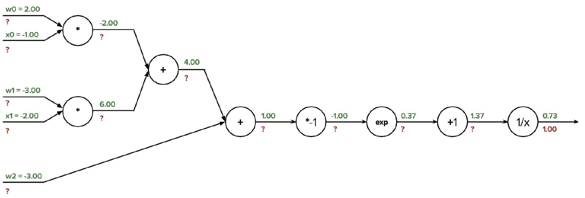

# Exercise week 3

This is your 3rd mandatory exercise for the track "Advanced Machine Learning in Computer Vision".
The tasks will be published on 5th September, and must be completed until a week later, i.e. Thursday 19.09.2024, 08:15. 
By that time you must fill out the checklist on the learnit page to indicate which tasks you volunteer to present. 
You are very welcome to present incomplete solutions and describe what challenges you faced.

 
## Task 1: Theory Backpropagation
In the lecture you saw the perceptron algorithm which is used to train weights for one neuron. For train neural networks with more nodes, backpropagation is used. 

Your task is to familiarize yourself with the material to fill knowledge gaps.  
Choose each one written and one video source (ore more) of the following. (NOte one bulletpoint counts as one source)

Helpful videos
- [3blue1brown-part1](https://www.youtube.com/watch?v=Ilg3gGewQ5U), [3blue1brown-part2](https://www.youtube.com/watch?v=tIeHLnjs5U8)
- [statquest](https://www.youtube.com/watch?v=IN2XmBhILt4)
- [Standford CNN Course](https://www.youtube.com/watch?v=d14TUNcbn1k)

From the Reading material:
- [PR] (Bishop) : 5.3. Error Backpropagation
- PML : 13.3 Backpropagation
- DL : 6.5 

Answer the following questions:
Be mindful that some might overlap. If you cannot answer one question, or the answer is unclear in your chosen material, elaborate. In this case choose one more source. 

a. Describe which sources you used, and which notation was used. Which symbols for: weights, input, output, loss function, etc. 

b. What is backpropagation in neural networks?

c. Explain the basic steps involved in backpropagation. What are forward and backward pass? (high-level)

d. How are gradients being computed? How is the chain rule used in backpropagation?

e. What is the vanishing gradient problem in backpropagation?

f. How does regularization affect backpropagation? What needs to be adapted?

## Task 2: Theory: apply backpropagation
Let's apply your new knowledge. 

a. Starting from left in the following graph:
$z = w_0x_0 + w_1x_1 + w_2$, $\alpha=\sigma(z)=1/(1+exp(-z))$. 
Use the provided graph to calculate the gradients indicated by the question marks. 

b. Report the symbolic gradients with respect to the input parameters $x_0$, $x_1$, $w_0$, $w_1$, $w_2$:

1. $\frac{\partial \alpha}{\partial x_0}=$
2. $\frac{\partial \alpha}{\partial x_1}=$
3. $\frac{\partial \alpha}{\partial w_0}=$
4. $\frac{\partial \alpha}{\partial w_1}=$
5. $\frac{\partial \alpha}{\partial w_2}=$

## Task 3: NN+CNN Theory

a. You have a 32x32x5 image and filter it with a 5x5x5 kernel. If you use no padding, what will be the output size of the activation map?

b. What is flattening?

c. Which pooling has a smoothing effect?

d. How and why is padding used?

e. What is a receptive field?

## Task 4: Programming CNN
Implement and monitor your own CNN. (You are free to use frameworks here.)
In the lecture you saw 3 different neural networks trained on the MNISt written digit dataset.
Your task is to implement one such a network.

a. Use [this notebook](https://colab.research.google.com/github/probml/pyprobml/blob/master/notebooks/book1/14/lenet_torch.ipynb) provided by the Murphy et al. as a starting point. 
Train the model 3 times and document your findings. Did the training converge? Do your results, i.e. accuracy, and loss curves, differ?

In the following do the following changes, then document and report your findings.
For each case make at least two changes. Consider how you wish to report your findings, i.e. with additional plots or numbers. 

b. change learning rate

c. Change the number of iterations. 

d. Change the architecture. 

e. (Bonus) Can you find a way to plot the feature maps?
